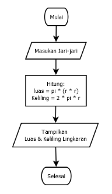

# Praktikum3

- FAQIH IRIANTO (312210021)
- TI.C1.22
- Disini saya menggunakan Aplikasi Code Editor Visual Studio Code

- Pertama-tama kita membuat repository terlebih dahulu dengan menyertakan file README seperti gambar berikut

- Proses pembuatan Repository pada Github sudah selesai

- Latihan 1
    - Disini kita belajar mengenal beberapa fungsi dari end, separator dan string format.
        - end berfungsi untuk penutup pada suatu kalimat
        - sep (separator berfungsi untuk) mencetak atau menampilkan objek ke output seperti ke layar atau file text. Dapat diisi dengan berbagai tanda baca yang menjadi objek pemisah suatu kata atau bilangan.
        - Fungsi format() berfungsi untuk melakukan pengaturan format string yang akan dicetak atau ditampilkan ke monitor.
        
        
        
        - Hasil Outputnya adalah seperti ini
        

- Latihan 2
    - Disini kita belajar input Variable yang kita inginkan
    - Seperti pada latihan kali ini kita akan mengimplementasikan variable sesuai keinginan kita.
    - Sebagai contoh seperti program pada kali ini meng-konversi nilai variable
    

    - Hasil outputnya sebagai berikut
    

- Latihan 3
    - Latihan ketiga ini kita akan membuat sebuah implementasi dari string formatting pada python
    

    - Outputnya seperti ini
    

- Program menghitung luas dan Keliling Lingkaran
    > Luas     = π × r² 
    > Keliling = 2 x π × r
    > Nilai Phi yang akan kita gunakan adalah 3.14
    > r merupakan jari-jari lingkaran

    - Flowchart Program
    

    - Code Program
    

    - Output Program
    

    > Penjelasan
    
    -Output 3.141592653589793
    - Program diatas saya mengimport modul math yang sudah di sediakan oleh python. Fungsinya supaya saya dapat menyertakan nilai phi yang sudah tersedia dalam modul tersebut dengan perintah math.pi jika kita coba mencetak fungsi tersebut maka akan menghasilkan nilai 3.14

    - Selanjutnya kita memerlukan nilai jari-jari (r) yang nantinya akan di masukan oleh pengguna pada layar console. Kita menggunakan fungsi input() yang nilainya di konversi ke tipe data float (bilangan riil). Ingat bahwa fungsi input() akan menganggap semua nilai inputan bertipe string, sehingga kita perlu melakukan konversi ke tipe yang diinginkan.

    - Lanjut kita tampilkan hasilnya dengan fungsi print(). sintak \t merupakan karakter espace yang berfungsi untuk membuat tab. dalam kasus ini agar sejajar karakter sama dengan (=) nya.

# Praktikum3 SELESAI
# TERIMA KASIH!